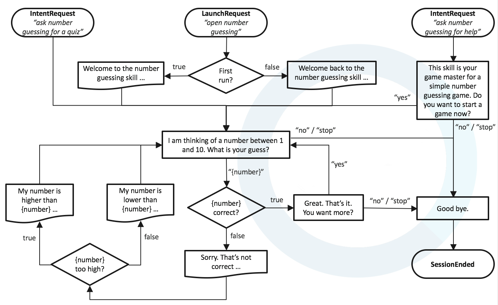

# Test Automation for Alexa Skills

## **Related Resources**

View [re:Invent workshop slides](https://www.slideshare.net/AmazonWebServices/alx315test-automation-for-alexa-skills) and check out the [Test SDK OpenSource Project @ Github](https://github.com/KayLerch/alexa-skills-kit-tester-java)

## **Prerequisites**

- **Amazon Developer Account** Go to the [Amazon developer console](https://developer.amazon.com/) to sign up for free in case you don't have an account yet.

- **AWS Developer Account** Go to the [AWS Signup pages](https://portal.aws.amazon.com/billing/signup#/) to create an account in case you don't already have it. You need a valid credit card and access to your mobile phone.

- **Node.js** is running on your system. If _$ node -v_ does not return a version number
 go to [Node.js downloads page](https://nodejs.org/en/download/) and install it.

- **Alexa Skills Kit Commandline Interface** (ask-cli) is installed on your host. If _$ ask -v_ does not return a version number in your console, install it with _$ npm install -g ask-cli_. If you are using Linux, the installation may require _sudo_. More details can be found in the ask-cli [quickstart guide](https://developer.amazon.com/docs/smapi/quick-start-alexa-skills-kit-command-line-interface.html)

## **Getting Started**

- Clone this Github repository on your local system.  

```bash
$ git clone https://github.com/alexa/skill-sample-nodejs-test-automation 
$ cd skill-sample-nodejs-test-automation
```

or [download](https://github.com/alexa/skill-sample-nodejs-test-automation/archive/master.zip) and unzip it

## **Lab guides**

- [Lab01](labs/lab01.md): SMAPI and ASK CLI
- [Lab02](labs/lab02.md): Service Simulator
- [Lab03](labs/lab03.md): Skill Invocation API and Simulation API
- [Lab04](labs/lab04.md): Set up the Test SDK and Client
- [Lab05](labs/lab05.md): Single-turn conversations
- [Lab06](labs/lab06.md): Multi-turn conversations
- [Lab07](labs/lab07.md): Multi-path conversations
- [Lab08](labs/lab08.md): Proactive Skill Monitoring

## **The Number Guessing Game skill**

You will work with an already implemented skill. It's a simple but fun number guessing game. 

