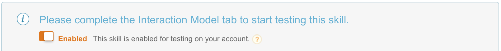
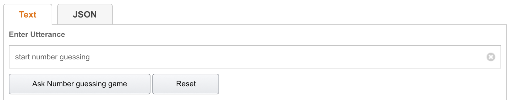

[<< Lab 1](lab01.md) | **Lab 2** | [Lab 3 >>](lab03.md)

# Lab Guide 2 - Service Simulator

## **What you will do in this lab**
Work with the Service Simulator tool in the [Amazon developer console](https://developer.amazon.com/) to manually test your freshly created Alexa skill.

## **What you will get at the end of this lab**
You have learned how to send utterances to your skill and how to examine the resulting request and response payloads send to and received from your skill Lambda endpoint.

## **Prerequisites**

- **Skill** which has been deployed to your Amazon developer account in [Lab 1](lab01.md).

## **Instructions**

### **2.1.) Play with Service Simulator** 

**2.1.1.** Go to the [Amazon developer console](https://developer.amazon.com/) and sign in. Select __Developer Console__ in the header section and navigate to __Alexa__. Click on __Alexa Skills Kit__. You should see the list of your skills - with _Number guessing game_ being one of them.
Click on the skill name __Number guessing game__ and go to the __Test__ section in the left menu. 

**2.1.2.** Enable testing for this skill for your developer account just in case it is not already showing up as _Enabled_.

**2.1.3.** You can now _Enter an Utterance_ and click on _Ask number guessing game_ to send the entered utterance to the skill endpoint.

In the underneath section you can examine the request and response payloads sent to and returned from the skill. Continue the dialog and interact with the skill by following the instructions returned by the skill (outputspeech portion in the response contains what Alexa would say to the user). The below Voice User Interface Diagram of the skill will help you.

__Side note: Numbers in utterances__: The Service Simulator does not resolve numbers in utterances when written as integers (e.g. "the number is 10"). Instead, you should always use numerals (e.g. "the number is **ten**").

**2.1.4.** Extra points: Go to [Echosim.io](https://echosim.io) and test this skill with your voice. Once you
logged in with your Amazon developer credentials you can hold down the space bar and start speaking - release the space bar when you'd like to finish your voice input. Start with _'open number guessing'_.

[<< Lab 1](lab01.md) | **Lab 2** | [Lab 3 >>](lab03.md)