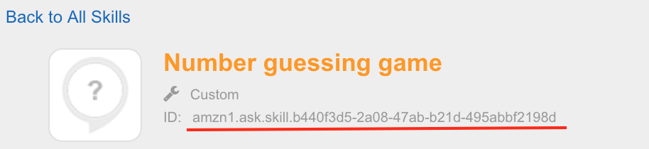
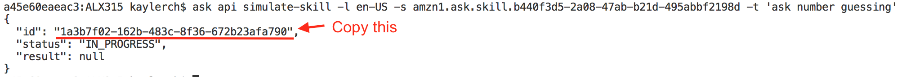

[<< Lab 2](lab02.md) | **Lab 3** | [Lab 4 >>](lab04.md)

# ALX315 - Lab Guide 3 - Skill Invocation API and Simulation API

## **What you will do in this lab**
Use the Skill Invocation API and Skill Simulation API - part of SMAPI - to test an Alexa skill by using ask-cli 

## **What you will get at the end of this lab**
You have learned how to fire requests at your skill by using the ask-cli.

## **Prerequisites**

- **Number guessing skill** which has been deployed to your Amazon developer account in [Lab 1](lab01.md).

- **Testing is enabled** for the _number guessing game_ skill. You should be fine if you followed step 2 in [Lab 2](lab02.md)

## **Instructions**

### **3.1.) Invoke a skill with ask-cli** 

**3.1.1.** Go back to the Service Simulator of the _number guessing game_ skill in your [Amazon developer console](https://developer.amazon.com/). Again, enter _"start number guessing"_ and hit the _Ask ..._ button. 


**3.1.2.** Copy the request payload from the left textbox and paste it into the existing but empty [./assets/launch.json](../assets/launch.json) file and save your changes. 

**3.1.3.** Next you go to the commandline and use ask-cli to fire the same request at your skill using the Invocation API. Run the following command from within the root folder of this repository.

```bash
$ ask api invoke-skill -e NA -s {skillId} -f assets/launch.json
```
- where _{skillId}_ needs to be replaced with the id of your skill you can find in the Amazon developer console (see screenshot below) or in the request payload you just copied (referred to as _applicationId_). 



An example:
```bash
$ ask api invoke-skill -e NA -s amzn1.ask.skill.b440f3d5-2a08-47ab-xxxx-495abbfxxxxd -f assets/launch.json
```

**3.1.4.** Inspect the returned response payload printed out in the console and try answer the following questions. 

__Q3.1.5__: Is the status of the request SUCCESSFUL?

__Q3.1.6__: Is the skill session left open? 

__Q3.1.7__: Can you spot the number Alexa thinks of in the current skill session? Prove it by typing in the correct answer in the Service Simulator where you just copied the request payload.

### **3.2.) Simulate user interaction** 

Instead of sending an entire payload to the skill endpoint, you will now just give it a written utterance as you would it give it to your skill via voice. 

__Please note__: Simulation API currently does not support multi-turn dialogs. That being said you can only test modal invocations (e.g. _"ask number guessing"_) or one-shot invocations (e.g. _"ask number guessing for help"_).

**3.2.1.** Run the following command in your commandline tool:

```bash
$ ask api simulate-skill -l en-US -s {skillId} -t '{utteranceText}'
```
- where _{skillId}_ needs to be replaced with the id of your skill
- where _{utteranceText}_ needs to be replaced by the text you'd like to send to the skill. It needs to be a valid modal or one-shot invocation starting with _"{ ask | open | start } number guessing ..."_. 

An example:
```bash
$ ask api simulate-skill -l en-US -s amzn1.ask.skill.b440f3d5-2a08-47ab-xxxx-495abbfxxxxd -t 'start number guessing'
```



**3.2.2.** Simulation API processes requests asynchronously. The response you get from above command contains an _id_ you can use to retrieve the actual response from the skill:

```bash
$ ask api get-simulation -s {skillId} -i {simulationId}
```
- where _{skillId}_ needs to be replaced with the id of your skill 
- where _{simulationId}_ needs to be replaced by the id returned by a _simulate-skill_ call (see screenshot)

An example:
```bash
$ ask api get-simulation -s amzn1.ask.skill.b440f3d5-2a08-47ab-xxxx-495abbfxxxxd -i d41b28a2-61f8-4fc3-a366-da49029cxxxx
```

**3.2.3.** Inspect the returned payload. It should look familiar to you as it is almost the same as  returned by the Invocation API.

### **3.3.) Extended testing**

**3.3.1.** try to ask this skill for help by using the Invocation API 

**3.3.2.** try to ask this skill for help by using the Simulation API 

**3.3.3.** try to bypass the welcome speech by using the Invocation API

**3.3.4.** try to bypass the welcome speech by using the Simulation API


[<< Lab 2](lab02.md) | **Lab 3** | [Lab 4 >>](lab04.md)