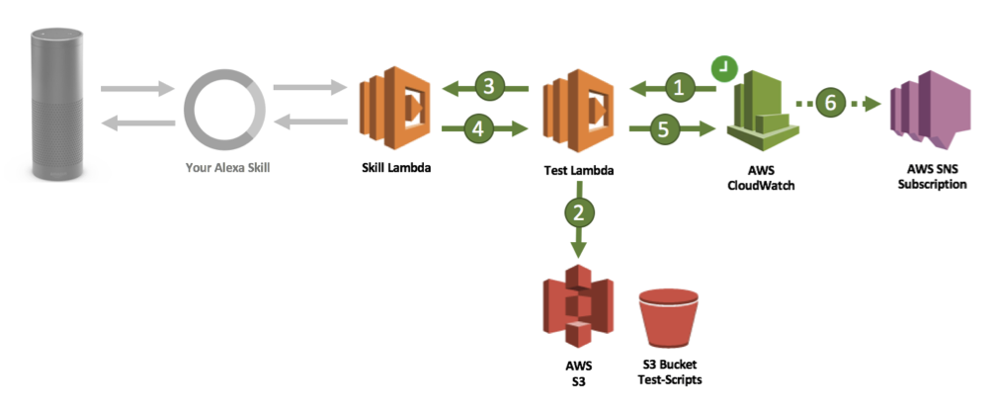
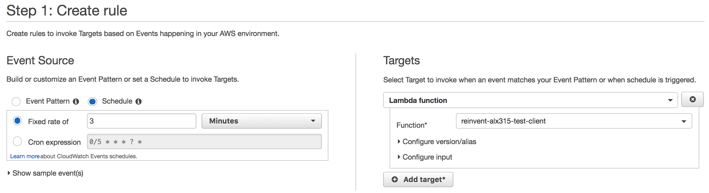
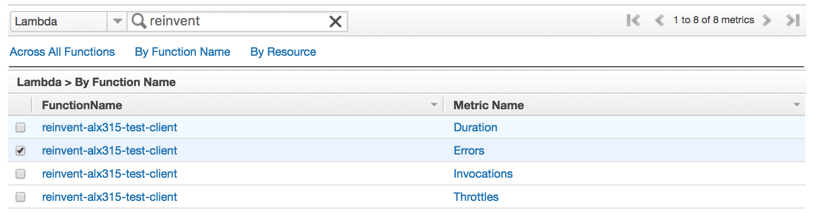
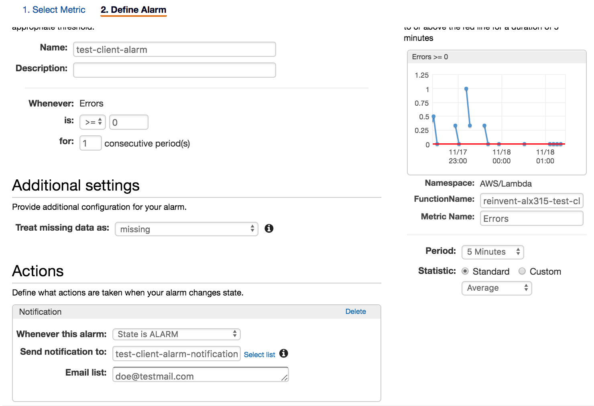

[<< Lab 7](lab07.md) | **Lab 8**

# ALX315 - Lab Guide 8 - Proactive Skill Monitoring

## **What you will do in this lab**
You will schedule periodical test executions for your skill and set up an alarm in case tests fail. 

## **What you will get at the end of this lab**
You have learned how to set up proactive monitoring for your (live) skill. 

## **Prerequisites**
- **Test Lambda function** you deployed in [Lab 4](lab04.md)
- **S3 Test-Script bucket** that was created in [Lab 4](lab04.md)
- **Number guessing skill** that was deployed to your Amazon developer account in [Lab 1](lab01.md)

## **Instructions**

### **8.1.) Schedule periodical executions** 

**8.1.1.** In the [AWS Developer console](https://console.aws.amazon.com/console/home) go to _Services_ -> _CloudWatch_ and navigate to _Rules_ in the left menu. Click on __Create Rule__.

**8.1.2.** Select _Schedule_ and set the fixed rate to 3 minutes.

**8.1.3.** In the right pane click on __Add target__ and point to the _reinvent-alx315-test-client_ Test Lambda function. 

Confirm with pressing the __Configure details__ button.

**8.1.4.** Set the name to _test-client-run-schedule_ and hit __Create rule__

The Test Lambda function will now execute every 3 minutes and simulates conversations like they are scripted in the YAML files stored in S3. 

**8.1.5.** Go back to _Services_ -> _Lambda_, navigate to the Test Lambda function and wait for a few minutes. In the _Monitoring_ tab on the Lambda detail page you should notice automatic executions. The logs but also the _Invocation errors_ dashboard tell you if the skill responses align with the assertions made in the YAML scripts. Remember, the Test Lambda function throws an error if one of those assertions is not met. 

### **8.2.) Set alarming on test failures**

As you don't want to manually look at CloudWatch metrics in order to see if your tests run smoothly, you would like to get notified instead. 

**8.2.1.** In the [AWS Developer console](https://console.aws.amazon.com/console/home) go to _Services_ -> _CloudWatch_ and navigate to _Alarms_. Click on __Create Alarm__.

**8.2.2.** Click on _Lambda Metrics_. In the search field type _reinvent_ to better find the Test Lambda function metrics. You're looking for the _Errors_ metric of the Lambda function _reinvent-alx315-test-client_.

Select it and click __Next__.

**8.2.3.** On the next page set this alarm's name to _test-client-alarm_. Set the threshold to _Whenever Error is >= 1 for 1 consecutive periods_.

**8.2.4.** In the _Actions_ section click on the _New list_ link. Set the _topic name_ to _test-client-alarm-notifications_ and enter your e-mail address in the _E-mail list_. You should have access to your mailbox in order to check if the alarm is sending out notifications. 

Confirm with hitting __Create Alarm__

**8.2.5.** CloudWatch sends a confirmation to your mail and waits for your approval on receiving notifications. Click on the confirmation link in the mail and return to CloudWatch.

**8.2.6.** The last exercise is to break something. If the scripts you created during the last labs all work fine, it is now time to let a test run fail. Make an assertion in one of the YAML-files you know will go wrong, upload this file to the S3 bucket and wait for up to 5 minutes. In CloudWatch you can check if the alarm gets triggered. Once this has happened, you should receive an e-mail.

### **8.3.) Clean up**

To avoid costs don't forget to:
- remove or disable the CloudWatch alarm you created.
- remove or disbale the CloudWatch rule you created.

If you'd like to remove all AWS resources you could also roll back and delete the CloudFormation stack. Just make sure you empty the S3 bucket before rolling it back. 

[<< Lab 7](lab07.md) | **Lab 8**